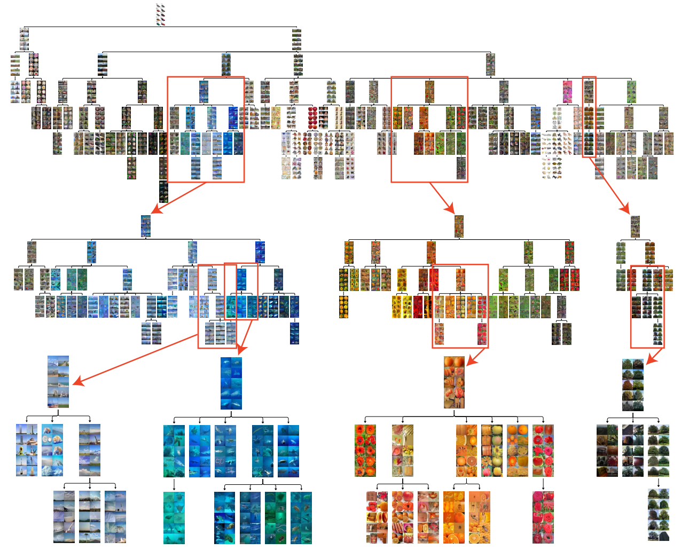
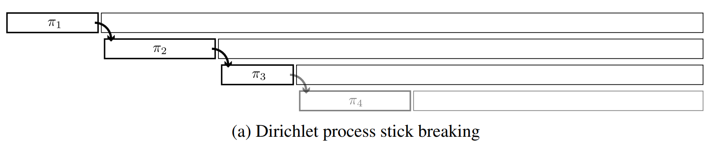
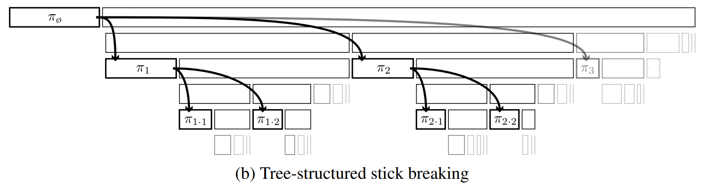

```{r setup, include=FALSE}
knitr::opts_chunk$set(echo = TRUE, collapse = TRUE, comment = "#>")
```

```{r, echo=FALSE, eval=T}
RootPath <- "/Users/yyq/Library/Mobile Documents/com~apple~CloudDocs/ipad_mac/github/[Yuan2015] BitPhylogeny/"
```


# Introduction

Clustering is one of the most important unsupervised learning problem. For example, in single-cell analysis, cells are grouped into several cell types based on the cell profile data. This is really useful when we hope to analyze the potential various cell types existed in the original tissue, or explore some new types. In image clustering problems, images are clustered based on some features (extracted from PCA or deep neural networks) to find some underlying relationships or patterns behind the images in the same cluster.

Recently, tree-structured clustering methods are getting more attention in *relationship reconstruction problem among subclones*. We need to simultaneously cluster the data into several groups and reconstruct the underlying relationship among these groups. Adams et al. (2010) proposed a novel nonparametric Bayesian prior named tree-structured stick-breaking prior (TSSB). They extended the stick-breaking process of DP to a two-dimension case. This method has been implemented in tumor subclone phylogeny reconstruction problem (Deshwar et al., 2015; Yuan et al., 2015). TSSB has infinite width and depth, and each datum can locate in any internal node of the tree. In (Adams et al.2010), TSSB was applied to image hierarchical clustering problem (CIFAR-100). They firstly extracted the 256 binary features $x\in \{0,1\}^{256}$ from a DNN, and then used the factored Bernoulli likelihood at each node. Note that the factored likelihood is based on the assumption that the elements of the data are independent. This setting can avoid the high dimensionality curse.

$$
f\left(x_{n} \mid \theta_{\epsilon}\right)=\prod_{d=1}^{256}\left(1+\exp \left\{-\theta_{\epsilon}^{(d)}\right\}\right)^{-x_{n}^{(d)}}\left(1+\exp \left\{\theta_{\epsilon}^{(d)}\right\}\right)^{1-x_{n}^{(d)}}
$$ 

<!-- <div align=center> -->
<!--  -->
<!-- </div> -->


```{r fig.align='center', out.width="70%", echo=F, message=F, eval=T}
library(knitr)

```


# Preliminaries

Adams et al. (2010) proposed a nonparametric Bayesian prior to model the underlying tree structure behind the different clusters, which is referred to as tree-structured stick-breaking process (TSSB). Recently, TSSB has been applied in some hierarchical clustering problem, such as image clustering (Adams et al. 2010) and tumor phylogeny reconstruction (Yuan et al. 2015, Deshwar et al. 2015). This prior has infinite depth and width and each datum can live at any internal node of the tree, not only the leaf nodes (different from the hierarchical clustering method).


## DP and stick breaking process

***Brief definition of Dirichlet process (DP).***

* A DP is a **random probability measure** $G$ defined on the probability space $S$ (prior on the space of probability measure, $\mathcal M(S)$). Denoted by $G\sim DP(\alpha,H)$.

* For measurable **finite** partition $\{B_1,...,B_k\}$ of $S$, the joint distribution of the vector $\left(G\left(B_{1}\right), \ldots, G\left(B_{k}\right)\right)$ is the **Dirichlet distribution** with parameters $\left(\alpha H\left(B_{1}\right), \ldots, \alpha H\left(B_{k}\right)\right)$.

***Stick breaking construction of DP (equivalent definition).*** 

DP is almost surely discrete probability measure (natural property for clustering). It can be written as (Sethuraman 1994)
$$
G(\cdot)=\sum_{k=1}^{\infty} \pi_{k} \delta_{Z_{k}}(\cdot)
$$

* $\delta_{Z_{k}}(\cdot)$ denote a discrete measure concentrated at $Z_k\stackrel{\text { iid }}{\sim} H$.

* $\pi_k$ are random weights, chosen to be independent of $Z_k$ and satisfy $\sum_{k=1}^N\pi_k=1$.

* $\pi_{1}=V_{1} \ \text { and } \ \pi_{k}=\left(1-V_{1}\right)\left(1-V_{2}\right) \cdots\left(1-V_{k-1}\right) V_{k}, \quad k \geq 2$.

* $V_k\stackrel{\text { iid }}{\sim} \text{Be}(1,\alpha).$

We can also denote $\mathbf{\pi}=(\pi_1,\pi_2,...)\sim \text{GEM}(\alpha)$, which is named after Griffiths, Engen, and McCloskey.

<!-- <div align=center> -->
<!--  -->
<!-- </div> -->

```{r fig.align='center', out.width="90%", echo=F, message=F, eval=T}
library(knitr)

```


***Truncation of DP.***

Ishwaran and James (2001) designed a block Gibbs sampler based on truncation version of stick-breaking process, denoted by 

$$
\sum_{k=1}^{N} \pi_{k} \delta_{Z_{k}}(\cdot),\quad N<\infty
$$
where

* $\pi_{1}=V_{1}, \quad \pi_{k}=V_k\prod_{j<k}\left(1-V_{j}\right), \quad k = 2,...,N.$ 
* Set $V_N=1$ to guarantee $\sum_{k=1}^N\pi_k=1$ with probability 1.

***Motivation of truncation.***

1. Limitations of <u>Polya urn Gibbs scheme</u> (marginalizing) for infinite measure: 

   * will lead to slowly mixing Markov chain (slowly converges to stationary distribution)
   * one-at-a-time updates
   * hard to solve non-conjugate cases 
   * difficult to find a unified sampling framework (*Griffin (2016) pointed out the unavailability of a suitable Polya urn scheme for some priors.*)
   
2. Block Gibbs sampler: 

   * simpler and more efficient
   * unified Gibbs framework
   * parallel computing (update a block of parameters each time)

***Non-parametric mixture model.***
In (Ishwaran and James, 2001), the mixture model is given by

$$
\begin{aligned}
\left(X_{i} \mid Y_{i}\right) & \stackrel{\text { ind }}{\sim} \pi\left(X_{i} \mid Y_{i}\right), \quad i=1, \ldots, n, \\
\left(Y_{i} \mid P\right) & \stackrel{\text { iid }}{\sim} P \\
P & \sim \mathcal{P}_N.
\end{aligned}
$$

~~To implement a Polya urn scheme sampler, integrate out the nonparametric prior.~~ (*Not recommended*)

To implement a block Gibbs sampler, introduce a index variable $K$. (*Data augmentation*)
$$
\begin{aligned}
\left(X_{i} \mid \mathbf{Z}, \mathbf{K}\right) & \stackrel{\text { ind }}{\sim} \pi\left(X_{i} \mid Z_{K_{i}}\right), \quad i=1, \ldots, n \\
\left(K_{i} \mid \mathbf{p}\right) & \stackrel{\mathrm{iid}}{\sim} \sum_{k=1}^{N} p_{k} \delta_{k}(\cdot),\quad N<\infty\\
(\mathbf{p}, \mathbf{Z}) & \sim \pi(\mathbf{p}) \times H^{N}(\mathbf{Z}),
\end{aligned}
$$

where

* $Y_i = Z_{K_i},\ Z_k\stackrel{\text { iid }}{\sim} H,\ k=1,...,N$.
* $\mathbf{p}=(p_1,...,p_N)\sim \text{GEM}_N(\alpha)$  (belongs to generalized dirichlet distribution - *won't go into details here*)
* $K_i$ are i.i.d and can be updated independently (parallel computing).

***Block Gibbs sampler.***

Update parameters **in blocks**.
$$
\begin{array}{l}
(\mathbf{Z} \mid \mathbf{K}, \mathbf{X}), \\
(\mathbf{K} \mid \mathbf{Z}, \mathbf{p}, \mathbf{X}), \\
(\mathbf{p} \mid \mathbf{K}),
\end{array}
$$

## Tree-structured stick-breaking process

***Extended to two breaking processes.*** 

Adams et al. (2010) proposed this two-dimensional stick-breaking process, referred to as tree-structured stick-breaking process (TSSB).

* $\nu$-breaks: decides the weight for staying at a node. 
  $$
  v_\epsilon \sim \text{Be}(1,\alpha(|\epsilon|))
  $$
  (Adams et al. suggested $\alpha(j)=\lambda^j\alpha_0$.)

* $\psi$-breaks: decides the weight for selecting a child node to descend. 
  $$
  \psi_\epsilon\sim \text{Be}(1,\gamma)
  $$

The random weights are then given by
$$
\pi_{\epsilon}=\nu_{\epsilon} \varphi_{\epsilon} \prod_{\epsilon^{\prime} \prec \epsilon} \varphi_{\epsilon^{\prime}}\left(1-\nu_{\epsilon^{\prime}}\right) \quad \varphi_{\epsilon \epsilon_{i}}=\psi_{\epsilon \epsilon_{i}} \prod_{j=1}^{\epsilon_{i}-1}\left(1-\psi_{\epsilon j}\right) \quad \pi_{\varnothing}=\nu_{\varnothing},
$$

<!-- <div align=center> -->
<!--  -->
<!-- </div> -->


```{r fig.align='center', out.width="90%", echo=F, message=F, eval=T}
library(knitr)

```


***Hierarchical priors for node parameters.***

* In DP, $Z_k$ are i.i.d. from the base measure $H$. 

* In TSSB, the i.i.d. assumption on the node parameters is inappropriate, since the random weights have a hierarchical structure. Hence we need a **transition distribution** for the node parameters.
  $$
  T(\theta_{\epsilon} \leftarrow \theta_{pa(\epsilon)})
  $$
where $\theta_{pa(\epsilon)}$ denote the parent node of $\theta_{\epsilon}$.


# Our model

Motivated by the work of Ishwaran and James (2001), in this report we propose a truncation version of TSSB, referred to as TSSB-DW (**TSSB** with finite **D**epth and **W**idth). Factored normal likelihood is used to avoid the high-dimensionality problem, and the prior of node parameters $\theta_{\varepsilon}$ and $\sigma_{\varepsilon}^{2}$ are the most commonly used conjugate prior Normal-invGamma distribution. The hyper-parameter $\lambda$ (sometimes called the drift parameter in $T(\theta_{\epsilon} \leftarrow \theta_{pa(\epsilon)})$) has inverse Gamma distribution. The hyper-parameter $\eta_{\mathcal{N}}$ and $\eta_{\Theta}$ are fixed.

$$
\begin{aligned}
\left( X_{i} \mid \theta, \Sigma, c_i=\varepsilon \right) & \stackrel{\text { ind }}{\sim} \prod_{\ell=1}^L N\left(X_{i}^\ell \mid \theta_{\varepsilon}^\ell, \eta_{\mathcal{N}}^{|\varepsilon|}\sigma_{\varepsilon}^{2\ell}\right), \quad i = 1,...,n \\
c_{i} \mid \pi & \stackrel{\text { iid }}{\sim} \sum_{\varepsilon} \pi_{\varepsilon} \delta_{{\varepsilon}} \\
\pi&\sim \text{TSSB-DW}(\alpha_0, \rho,\gamma)\\
\theta_{\varnothing}^\ell &\sim N(\theta_{\varnothing}^\ell\mid \mu_0^\ell,  \lambda^\ell), \quad \ell=1,...,L\\
\theta_{\varepsilon}^\ell \mid \theta_{pa(\varepsilon)}^\ell, \eta_{\Theta}& \stackrel{\text { iid }}{\sim} N(\theta_{\varepsilon}^\ell\mid \theta_{pa(\varepsilon)}, \eta_{\Theta}^{|\varepsilon|}\lambda^\ell)\\
\sigma_{\varepsilon}^{2\ell} &\stackrel{\text { iid }}{\sim} \text{InvGamma}(v_{sig}, s_{sig})\\
\lambda^\ell & \stackrel{\text { iid }}{\sim} \text{InvGamma}(v_{dft}, s_{dft})
\end{aligned}
$$

Another option of the prior of drift is uniform distribution.

$$
\lambda^\ell \stackrel{\text { iid }}{\sim} \text{Unif }(\min, \max)
$$

## Posterior inference

The posterior inference includes the following steps.

***Conditional for $\theta_{\varepsilon}^\ell,\ \ell=1,...,L$***

\[
\begin{aligned}
p\left(\theta_{\varepsilon}^\ell \mid-\right)
&\propto N\left(\theta_{\varepsilon}^\ell \mid \theta_{pa(\varepsilon)}^\ell,  \eta_{\Theta}^{|\varepsilon|} \lambda^{\ell}\right)
\prod_{ch(\varepsilon)} N\left(\theta_{ch(\varepsilon)}^\ell \mid \theta_{\varepsilon}^\ell,  \eta_{\Theta}^{|\varepsilon|+1} \lambda^{\ell}\right)
\prod_{\left\{i: c_{i}=\varepsilon\right\}} N\left(X_{i}^\ell \mid \theta_{\varepsilon}^\ell,  \eta_{\mathcal{N}}^{|\varepsilon|} \sigma_{\varepsilon}^{2\ell}\right) \\
&\propto N(\mu_{\varepsilon}^\ell,\tau_{\varepsilon}^\ell)
\end{aligned}
\]
where
\[
\begin{aligned}
&\mu_{\varepsilon}^\ell=\left( \frac{N_{\varepsilon} \bar{X}_{\varepsilon}^\ell }{ \eta_{\mathcal{N}}^{|\varepsilon|}\sigma_{\varepsilon}^{2\ell}}  + \frac{W \bar{\theta}_{c h(\varepsilon)}^{\ell(t-1)}+ \eta_{\Theta}\theta_{pa(\varepsilon)}^{\ell(t)}}{ \eta_{\Theta}^{|\varepsilon|+1}\lambda^{\ell}}  \right)  \left( \frac{N_{\varepsilon}}{\eta_{\mathcal{N}}^{|\varepsilon|}\sigma_{\varepsilon}^{2\ell} } + \frac{W+\eta_{\Theta}}{\eta_{\Theta}^{|\varepsilon|+1}\lambda^{\ell}} \right)^{-1},\\
&\tau_{\varepsilon}^\ell=  \left(\frac{N_{\varepsilon}}{\eta_{\mathcal{N}}^{|\varepsilon|}\sigma_{\varepsilon}^{2\ell} } + \frac{W+\eta_{\Theta}}{\eta_{\Theta}^{|\varepsilon|+1}\lambda^{\ell}} \right)^{-1}.\\
\end{aligned}
\]
and $N_{\varepsilon}$ is the number of data stopping at node $\varepsilon$. If $N_{\varepsilon} =0$, then
$$
\mu_{\varepsilon}^\ell= \frac{W \bar{\theta}_{c h(\varepsilon)}^{\ell(t-1)}+\eta_{\Theta}\theta_{pa(\varepsilon)}^{\ell(t)}}{W+\eta_{\Theta}} ,\quad \tau_{\varepsilon}^\ell=\frac{\eta_{\Theta}^{|\varepsilon|+1}\lambda^\ell}{W+\eta_{\Theta}}
$$


***Conditional for $\sigma_{\varepsilon}^{2\ell},\ \ell=1,...,L$***

$$
\begin{aligned}
p\left(\sigma_{\varepsilon}^{2\ell} \mid-\right) & \propto \prod_{\left\{i: c_{i}=\varepsilon\right\}} N\left(X_{i}^\ell \mid \theta_{\varepsilon}^\ell,\eta_{\mathcal{N}}^{|\varepsilon|} \sigma_{\varepsilon}^{2\ell}\right) \text{InvGamma}\left(v_{sig}, s_{s i g}\right) \\
&\propto \text{InvGamma}\left(\tilde{v}_{sig}^\ell, \tilde{s}_{s i g}^\ell\right)
\end{aligned}
$$
where
\[
\begin{aligned}
\tilde{v}_{sig}^\ell &= v_{sig} + N_\varepsilon / 2\\
\tilde{s}_{sig}^\ell &= s_{s i g} + \frac1{2\eta_{\mathcal{N}}^{|\varepsilon|}} \sum_{\left\{i: c_{i}=\varepsilon\right\}} \left(X_i^\ell - \theta_{\varepsilon}^\ell \right)^2
\end{aligned}
\]
Note that if there is no datum at the current node (i.e., $N_\varepsilon=0$), then $v,s$ do not change. The density of inverse Gamma distribution InvGamma$(v,s)$ is
$$
p(x)=\frac{s^{v}}{\Gamma(v)} x^{-(v+1)} \exp \left(-\frac{s}{x}\right)
$$
where $v>0$ and $s>0$ are called shape and scale parameter respectively.

***Conditional for $c$***

$$
p\left(c_{i} \mid \theta,\Sigma,\pi, X\right) \stackrel{\text { ind }}{\sim} \sum_{\varepsilon} \beta_{\varepsilon}^{(i)} \delta_{\varepsilon}\\
$$
where
$$
\beta_{\varepsilon}^{(i)} \propto \pi_{\varepsilon} \prod_{\ell=1}^L N\left(X_{i}^\ell \mid \theta_{\varepsilon}^\ell, \eta_{\mathcal{N}}^{|\varepsilon|}\sigma_{\varepsilon}^{2\ell}\right)
$$


***Conditional for $\pi$***

The key is to update $\nu$ and $\psi$, and $\pi_{\varepsilon}$ are given by

$$
\pi_{\varepsilon}=\nu_{\varepsilon}^{*} \psi_{\varepsilon}^{*} \prod_{\varepsilon^{\prime}\prec\varepsilon} \psi_{\varepsilon^{\prime}}^{*}\left(1-\nu_{\varepsilon^{\prime}}^{*}\right)
$$
where

$$
\begin{aligned}
\nu_{\varepsilon}^{*}& \stackrel{\text { ind }}{\sim} \operatorname{Be}\left(1+N_{\varepsilon},\ \alpha(|\varepsilon|)+N_{\varepsilon\prec\cdot}\right) \\
\psi_{\varepsilon e_{i}}^{*}& \stackrel{\text { ind }}{\sim} \operatorname{Be}(1+N_{\varepsilon e_{i}\preccurlyeq\cdot},\ \gamma+\sum_{j>e_{i}} N_{\varepsilon j\preccurlyeq\cdot})
\end{aligned}
$$
$N_{\varepsilon} = \# \{i: c_i = \varepsilon\}$ is the number of data stopping at the node $\varepsilon$,  $N_{\varepsilon\prec\cdot}$ is "the number of data that come down this path but does not stop at $\varepsilon$", and $N_{\varepsilon \preccurlyeq\cdot}$ is equal to $N_{\varepsilon}+N_{\varepsilon \prec\cdot}$


***Conditional for the hyperparameter drift $\lambda^\ell,\ \ell=1,...,L$***

\[
\begin{aligned}
p(\lambda^\ell\mid -) & \propto \prod_{\varepsilon} N\left(\theta_{\varepsilon}^\ell \mid \theta_{pa(\varepsilon)}^\ell, \eta_{\Theta}^{|\varepsilon|}\lambda^\ell \right)  \text{InvGamma}\left(v_{dft}, s_{dft}\right) \\
&\propto  \text{InvGamma}\left(\tilde{v}_{dft}^\ell, \tilde{s}_{dft}^\ell\right)
\end{aligned}
\]
where
\[
\begin{aligned}
\tilde{v}_{dft}^\ell &= v_{dft} + N_{nodes}/2,\quad N_{nodes} = 1+\cdots+W^D = \frac{W^{D+1}-1}{W-1}\\
\tilde{s}_{dft}^\ell &= s_{dft} + \sum_{\varepsilon} \frac1{2\eta_{\Theta}^{|\varepsilon|}}(\theta_{\varepsilon}^\ell - \theta_{pa(\varepsilon)}^\ell)^2
\end{aligned}
\]
Note that when $\varepsilon=\varnothing$, then $\theta_{pa(\varepsilon)}$ is equal to the initial mean $\mu_0.$ (since the prior of $\theta_{\varnothing}$ also includes the drift)

***Conditional for the hyperparameters $\alpha_0,\rho,\gamma$***

In (Adams et al.2010), the authors used the slice sampler to update these hyperparameters. This is slice sampler-within-Gibbs framework.

$$
\begin{aligned}
p\left(\alpha_{0}, \lambda \mid\left\{\nu_{\epsilon}\right\}\right) &\propto \mathbb{I}\left(\alpha_{0}^{\min }<\alpha_{0}<\alpha_{0}^{\max }\right) \mathbb{I}\left(\lambda^{\min }<\lambda<\lambda^{\max }\right) \prod_{\epsilon} \operatorname{Be}\left(\nu_{\epsilon} \mid 1, \lambda^{|\epsilon|} \alpha_{0}\right) \\
p\left(\gamma \mid\left\{\psi_{\epsilon}\right\}\right) &\propto \mathbb{I}\left(\gamma^{\min }<\gamma<\gamma^{\max }\right) \prod_{\epsilon} \operatorname{Be}\left(\psi_{\epsilon} \mid 1, \gamma\right)
\end{aligned}
$$


***Search for tree structure***

In (Yuan et al. 2015), the authors added another swap-nodes step to propose a new tree structure. They switched the data Ids, node parameters ($\theta_{\varepsilon}$ and $\sigma_{\varepsilon}^{2}$) and $\nu$-breaks $\nu_{\varepsilon}$ of the two chosen nodes. The proposal would be accepted if the new unnormalized posterior is large than the old one. Here we follow the idea in (Yuan et al. 2015).

<!-- * Resample data assignments $c_i$ for $i=1,...,n$. (multinoulli) -->

<!-- * Resample node parameters $\theta_{\varepsilon}^\ell$ and $\sigma_{\varepsilon}^{2\ell}$ for $\ell = 1,...,L$. (normal-invGamma) -->

<!-- * Resample stick length $\nu$-sticks and $\psi$-sticks, in order to update the random weights $\pi_\varepsilon$. (like in DP) -->

<!-- * Resample hyper-parameter drift $\lambda^\ell$ for $\ell = 1,...,L$. -->
<!--   * Inverse Gamma prior: the posterior of $\lambda^\ell$ is tractable. -->
<!--   * Uniform prior: slice-sampler-within-Gibbs -->

<!-- * Resample stick-breaking hyper-parameters $\alpha_0,\lambda,\gamma$ by slice sampler. -->

<!-- * Search for new tree structure. In (Yuan et al. 2015), the authors added another swap-nodes step to propose a new tree structure. They switched the data Ids, node parameters ($\theta_{\varepsilon}$ and $\sigma_{\varepsilon}^{2}$) and $\nu$-breaks $\nu_{\varepsilon}$ of the two nodes. The proposal would be accepted if the new unnormalized posterior is large than the old one. -->

<!-- Recall that $\eta_{\mathcal{N}}$ and $\eta_{\Theta}$ are fixed. -->


# Simulation study

## Prepare data

*Data:* 7 classes normal data. Separable. Dims:  700 $\times$ 2 dims

Import the packages we will need.

```{r, message=F}
library(igraph)
library(ggplot2)
library(networkD3)
```


```{r, echo=F}
# 统一的文档
path <- paste0(RootPath, 'bitphyloR_AddComment/R/')
source(paste0(path, 'util.R'), echo=F)
source(paste0(path, 'distn.R'), echo=F)
source(paste0(path, 'mvnorm.R'), echo=F)

# tssb_dw_factored
path <- paste0(RootPath, 'bitphyloR_test_dw_Factored_eta_ST/')
source(paste0(path, 'dw_Factored_eta_ST_node_normal.R'), echo=F)
source(paste0(path, 'dw_Factored_eta_ST_node.R'), echo=F)
source(paste0(path, 'dw_Factored_eta_ST_tssb_inference_mcmc.R'), echo=F)
source(paste0(path, 'dw_Factored_eta_ST_tssb.R'), echo=F)
source(paste0(path, 'dw_Factored_eta_ST_run.R'), echo=F)

### auxiliary functions
for (i in 1){
  path <- paste0(RootPath, '我的 test/Summary/')
  source(paste0(path, 'auxiliary_func.R'), echo=F)
}
```

In this study, the data matrix are 700 $\times$ 2. There are seven classes, each of which has 100 data. 

```{r}
set.seed(24)

m <- 700
dims <- 2
testData <- rbind(rmvnorm(m/7, mean = rep(2.0, dims), sigma = diag(0.10^2, dims, dims)),
                  rmvnorm(m/7, mean = rep(3.5, dims), sigma = diag(0.03^2, dims, dims)),
                  rmvnorm(m/7, mean = c(3.8, 4.0), sigma = diag(0.01^2, dims, dims)),
                  rmvnorm(m/7, mean = c(4.0, 3.8), sigma = diag(0.01^2, dims, dims)),
                  
                  rmvnorm(m/7, mean = rep(0.7, dims), sigma = diag(0.03^2, dims, dims)),
                  rmvnorm(m/7, mean = c(0.5, 0.3), sigma = diag(0.01^2, dims, dims)),
                  rmvnorm(m/7, mean = c(0.3, 0.5), sigma = diag(0.01^2, dims, dims))
)
numOfData = nrow(testData)
plot(testData[,1], testData[,2])
```

## Initialization and training

The settings of implementing the model are:

* $\eta_{\mathcal{N}}=1$ and $\eta_{\Theta}=0.5$
* Update order: i) Node parameters, ii) Data assignments, iii) Swap nodes
* burnIn = 100, Iter = 1000
* maxDepth = 3, maxWidth = 3
* "OnlyTree"

The drift $\lambda$ is assigned the **inverse Gamma** prior. Then we **initialize** the Root Node and the corresponding Tssb.
```{r}
empCov <- cov(t(testData))
empCov2 <- cov(testData)
priorSigmaScale = mean(diag(empCov))
priorDriftScale = min(diag(empCov2))
  
minDepth  <- 0
maxDepth  <- 3
maxWidth  <- 3
etaNormal <- 1
etaTheta  <- 0.3
Flag.onlyTree <- T

q0 <- Normal_DW_Factored_eta_ST$new(priorSigmaScale = priorSigmaScale,
                               priorDriftScale = priorDriftScale,
                               etaNormal = etaNormal, etaTheta = etaTheta,
                               dataDims = ncol(testData))

tssbMCMC <- TssbMCMC_DW_Factored_eta_ST$new(q0, data = testData,
                               dpAlpha = 1, dpGamma = 1, dpLambda = 1,
                               maxDepth = maxDepth, minDepth = minDepth, 
                               maxWidth = maxWidth,
                               Flag.onlyTree = Flag.onlyTree)  
```


After initialization, we update all the parameters using Gibbs sampler.
```{r, echo=F}
Flag = F
swapMain = T
numOfMCMC = 1000
burnIn = 100
numOfOutput = 500

tssb <- tssbMCMC

ll_dwinvga = array(0, dim = numOfMCMC)
clIds_dwinvga <- matrix(0, nrow = (numOfMCMC - burnIn), ncol = numOfData)
centers_dwinvga <- vector(mode = "list", length = (numOfMCMC - burnIn))
numOfBigNode_dwinvga <- array(0, dim = (numOfMCMC - burnIn))


for (i in 0:numOfMCMC){
  verbose <- (i%%numOfOutput == 0)
  
  if (verbose) cat("==== iter: ", i, "\n")
  if (i == (burnIn+1)) startTime <- Sys.time()
  
  start.time <- Sys.time()
  tssb$ResampleNodeParameters(Flag)
  end.time <- Sys.time()
  if (verbose) cat("Update node params: ", end.time - start.time, "\n")
  
  start.time <- Sys.time()
  tssb$root$node$ResampleHyperDrift(Flag)
  end.time <- Sys.time()
  if (verbose) cat("Update drift: ", end.time - start.time, "\n")
  
  
  start.time <- Sys.time()
  tssb$ResampleSticks(Flag)
  end.time <- Sys.time()
  if (verbose) cat("Update sticks: ", end.time - start.time, "\n")
  
  start.time <- Sys.time()
  tssb$ResampleHypers(verbose = Flag)
  end.time <- Sys.time()
  if (verbose) cat("Update 3 hypers: ", end.time - start.time, "\n")
  
  start.time <- Sys.time()
  tssb$ResampleAssignments(Flag)
  end.time <- Sys.time()
  if (verbose) cat("Update assignments: ", end.time - start.time, "\n")
  
  ########################
  ### Search Tree
  start.time <- Sys.time()
  # tssb$SearchTree(swapMain=swapMain, verbose=T)
  tssb$SearchTreeYuan(swapMain=swapMain)
  end.time <- Sys.time()
  if (verbose) cat("Swap-nodes move: ", end.time - start.time, "\n")
  ########################
  
  start.time <- Sys.time()
  tssb$KeepTree(Flag.onlyTree)
  end.time <- Sys.time()
  if (verbose) cat("Update Keep tree: ", end.time - start.time, "\n")
  
  if (i == numOfMCMC) endTime <- Sys.time()
  
  
  res <- tssb$GetLogMarginalDataLikelihood()
  ll_dwinvga[i] <- res$ll  # 记录所有 likelihood，包括 burnIn 之前的
  
  if (i > burnIn) {
    resOfCl <- ClusterSummary(tssb$root, tssbType = "tssbdw")
    eachCenter <- resOfCl$centers
    rownames(eachCenter) <- resOfCl$nodeIds
    clIds_dwinvga[(i-burnIn), ] <- resOfCl$clIds
    centers_dwinvga[[i-burnIn]] <- eachCenter
    numOfBigNode_dwinvga[i-burnIn] <- sum(res$ww > 0.01)
  }
}

# Plot likelihood
exeTime_dwinvga <- endTime - startTime
```

The total execution time is 
```{r, echo=F}
print(exeTime_dwinvga)
```

## Results

we plot the log-likelihood curve to demonstrate the convergence of the Markov chain.

```{r, echo=F}
plot(ll_dwinvga, type="l")
```

Finally, we plot the tree structure result using `forceNetwork` function in `networkD3` package.

```{r, echo=F}
# Plot by networkD3
PlotDescend = function(root, num, nodeNames) {
  dataIds <- root$node$dataIds
  nodeNames[num] <- paste(paste(nodeNames[num], paste(min(dataIds), max(dataIds), sep="-")), paste0("(", length(dataIds), ")"))
  children <- root$children
  for (i in seq_along(children)) {
    num = num + 1
    res <- PlotDescend(children[[i]], num, nodeNames)
    nodeNames <- res$nodeNames
    num <- res$num
  }
  return(list(nodeNames = nodeNames, num = num))
}

# Cull the tree & generate the igraph variable
tssb$CullTree()
g0 <- tssb$ConvertTssbToIgraph()$g

# igraph -> networkD3
a = igraph_to_networkD3(g0)
if (tssb$root$node$dataDims < 5) {
  group <- paste("drift:", paste(round(tssb$root$node$GetDrift(), 2), collapse = ", "))
} else {
  group <- paste("drift:", paste(round(quantile(tssb$root$node$GetDrift()), 2), collapse = ", "))
}
a$nodes$group <- group
a$nodes$name <- PlotDescend(tssb$root, num=1, a$nodes$name)$nodeNames

# Plot the network
forceNetwork(a$links, a$nodes, Source = 'source', Target = 'target',
             NodeID = 'name', Group = 'group', 
             zoom = T, legend = T)
```

**Select a single tree**

To determine the final tree structure, (Yuan et al. 2015) provided an idea. They referred to the number of nodes whose weight is larger than 0.01 as the **big node number (BNN)**. 

1. Group all MCMC samples into unique BNN categories. 
2. Find out the most frequently occurring unique BNN group.
3. Choose the tree structure in this group which has the maximum marginal likelihood. 

```{r, echo=F}
numOfBigNode = numOfBigNode_dwinvga
ll = ll_dwinvga
clIds = clIds_dwinvga

uniqueBNN <- unique(numOfBigNode)
freq <- unlist(Map(function(i) {sum(numOfBigNode == uniqueBNN[i])}, 1:length(uniqueBNN)))
mostFreBNN <- uniqueBNN[which.max(freq)]
llAfterBurnIn <- ll[(burnIn+1):numOfMCMC]
tssbNum <- which(llAfterBurnIn == max(llAfterBurnIn[numOfBigNode == mostFreBNN]))
# tssbNum <- which(llAfterBurnIn == max(llAfterBurnIn[numOfBigNode == 7]))
# tssbNum <- which.max(llAfterBurnIn)

finalClIds <- clIds[tssbNum,]
plot_data <- as.data.frame(testData)
plot_data$clIds <- finalClIds
p2 <- ggplot(plot_data, aes(x = V1, y=V2)) +
  geom_point(aes(color = factor(clIds)))
p2
```

All the data are separated correctly based on their class.

```{r, echo=F}
centers <- centers_dwinvga[[tssbNum]]

# Show the branch situations
rowName <- rownames(centers)
centerCol <- centers[, 1]
rowName <- rowName[centerCol != Inf]
lastBranch <- rowName[length(rowName)]
maxWidthFinal <- as.numeric(unlist(strsplit(lastBranch, split = "-"))[2])

ind <- array(0, dim = numOfData)
ind[which(finalClIds == 1)] <- "X branch"

for (i in 1:maxWidthFinal) {
  strName <- paste0("X-", i)
  clusterInd <- (1:length(rowName))[grepl(strName, rowName)]
  ind[finalClIds %in% clusterInd] <- paste(strName, "branch")
}

plot_data <- as.data.frame(testData)
plot_data$ind <- ind
p2 <- ggplot(plot_data, aes(x = V1, y=V2)) +
  geom_point(aes(color = factor(ind)))
p2
```


# MNIST dataset

*MNIST* is a famous handwritten digits data set. 

* Training: 60,000 images, Test: 10,000 images. 
* Each image has 28x28 pixels. 
* Each pixel of the image is in [0,255].

## Prepare the MNIST-mini data

We extracted **5-dim features** for all training data from an *AutoEncoder* pre-trained using the whole training set. Then we sampled a subset of the training set where **each digit has 100 samples**. Therefore, the dimensions of data matrix we finally used is **$1000\times 5$**. (*The features extracted from AutoEncoder are partly separated, which is helpful for subsequent clustering.*)

<!-- ```{r fig.align='center', out.width="70%", echo=F, message=F, eval=T} -->
<!-- library(knitr) -->
<!-- include_graphics(path.expand(paste0(figpath, "MNIST_mini.png"))) -->
<!-- ``` -->

The settings are the same as in the simulation study, except that 

* burnIn = 500, Iter = 3,000.

```{r, echo=F}
fin <- "/Users/yyq/Library/Mobile Documents/com~apple~CloudDocs/ipad_mac/github/[Yuan2015] BitPhylogeny/我的 test/mnist"

mnistDataAE <- read.csv(file = paste(fin, "mnistFeaturesAE5D1.csv", sep = "/"), header = F)
mnistFeaturesAE <- mnistDataAE[,-1]
mnistLabelAE <- mnistDataAE[,1]

set.seed(12)

numOfEachDigit <- 100
SelMiniData <- function(i) {
  indices <- sample(which(mnistLabelAE == i), numOfEachDigit)
  mnistDataAE[indices,]
}

miniData <- Reduce(rbind, Map(SelMiniData, 0:9))
mini_X <- miniData[,-1]
mini_y <- miniData[,1]

# mini-Data
testData <- as.matrix(mini_X)
numOfData <- nrow(testData)
colnames(testData) <- paste0("V", 1:dim(testData)[2])

p <- ggplot(data = data.frame(x = mini_X[,1], y = mini_X[,2], digits = mini_y), 
            aes(x=x, y=y, group=digits)) +
  geom_point(aes(color = factor(digits)))
p
```

## Initialization and training

```{r, echo=F}
empCov <- cov(t(testData))
empCov2 <- cov(testData)
priorSigmaScale = mean(diag(empCov))
priorDriftScale = min(diag(empCov2))
  
minDepth  <- 0
maxDepth  <- 3
maxWidth  <- 3
etaNormal <- 1
etaTheta  <- 0.3
Flag.onlyTree <- T

q0 <- Normal_DW_Factored_eta_ST$new(priorSigmaScale = priorSigmaScale,
                               priorDriftScale = priorDriftScale,
                               etaNormal = etaNormal, etaTheta = etaTheta,
                               dataDims = ncol(testData))

tssbMCMC <- TssbMCMC_DW_Factored_eta_ST$new(q0, data = testData,
                                            dpAlpha = 1, dpGamma = 1, dpLambda = 1,
                                            maxDepth = maxDepth, minDepth = minDepth, maxWidth = maxWidth,
                                            Flag.onlyTree = Flag.onlyTree)
```


After initialization, we update all the parameters using Gibbs sampler.
```{r, echo=F}
numOfMCMC = 3000
burnIn = 500
numOfOutput = 1000

tssb <- tssbMCMC

ll_dwinvga = array(0, dim = numOfMCMC)
clIds_dwinvga <- matrix(0, nrow = (numOfMCMC - burnIn), ncol = numOfData)
centers_dwinvga <- vector(mode = "list", length = (numOfMCMC - burnIn))
numOfBigNode_dwinvga <- array(0, dim = (numOfMCMC - burnIn))


for (i in 0:numOfMCMC){
  verbose <- (i%%numOfOutput == 0)
  
  if (verbose) cat("==== iter: ", i, "\n")
  if (i == (burnIn+1)) startTime <- Sys.time()
  
  start.time <- Sys.time()
  tssb$ResampleNodeParameters(Flag)
  end.time <- Sys.time()
  if (verbose) cat("Update node params: ", end.time - start.time, "\n")
  
  start.time <- Sys.time()
  tssb$root$node$ResampleHyperDrift(Flag)
  end.time <- Sys.time()
  if (verbose) cat("Update drift: ", end.time - start.time, "\n")
  
  
  start.time <- Sys.time()
  tssb$ResampleSticks(Flag)
  end.time <- Sys.time()
  if (verbose) cat("Update sticks: ", end.time - start.time, "\n")
  
  start.time <- Sys.time()
  tssb$ResampleHypers(verbose = Flag)
  end.time <- Sys.time()
  if (verbose) cat("Update 3 hypers: ", end.time - start.time, "\n")
  
  start.time <- Sys.time()
  tssb$ResampleAssignments(Flag)
  end.time <- Sys.time()
  if (verbose) cat("Update assignments: ", end.time - start.time, "\n")
  
  ########################
  ### Search Tree
  start.time <- Sys.time()
  # tssb$SearchTree(swapMain=swapMain, verbose=T)
  tssb$SearchTreeYuan(swapMain=swapMain)
  end.time <- Sys.time()
  if (verbose) cat("Swap-nodes move: ", end.time - start.time, "\n")
  ########################
  
  start.time <- Sys.time()
  tssb$KeepTree(Flag.onlyTree)
  end.time <- Sys.time()
  if (verbose) cat("Update Keep tree: ", end.time - start.time, "\n")
  
  if (i == numOfMCMC) endTime <- Sys.time()
  
  
  res <- tssb$GetLogMarginalDataLikelihood()
  ll_dwinvga[i] <- res$ll
  
  if (i > burnIn) {
    resOfCl <- ClusterSummary(tssb$root, tssbType = "tssbdw")
    eachCenter <- resOfCl$centers
    rownames(eachCenter) <- resOfCl$nodeIds
    clIds_dwinvga[(i-burnIn), ] <- resOfCl$clIds
    centers_dwinvga[[i-burnIn]] <- eachCenter
    numOfBigNode_dwinvga[i-burnIn] <- sum(res$ww > 0.01)
  }
}

# Plot likelihood
exeTime_dwinvga <- endTime - startTime
```

```{r, echo=F}
cat("Total execution time: ")
print(exeTime_dwinvga)
```

## Results

The clustering result is shown in the following figure.

```{r, echo=F}
numOfBigNode = numOfBigNode_dwinvga
ll = ll_dwinvga
clIds = clIds_dwinvga

uniqueBNN <- unique(numOfBigNode)
freq <- unlist(Map(function(i) {sum(numOfBigNode == uniqueBNN[i])}, 1:length(uniqueBNN)))
mostFreBNN <- uniqueBNN[which.max(freq)]
llAfterBurnIn <- ll[(burnIn+1):numOfMCMC]
tssbNum <- which(llAfterBurnIn == max(llAfterBurnIn[numOfBigNode == mostFreBNN]))
# tssbNum <- which(llAfterBurnIn == max(llAfterBurnIn[numOfBigNode == 7]))
# tssbNum <- which.max(llAfterBurnIn)

finalClIds <- clIds[tssbNum,]
plot_data <- as.data.frame(testData)
plot_data$clIds <- finalClIds
p2 <- ggplot(plot_data, aes(x = V1, y=V2)) +
  geom_point(aes(color = factor(clIds)))
p2
```

**Result 1.** Data are clustered almost based on their true classes, although there is a large overlap area. This demonstrates the ability of our model to cluster data with overlapping.

Next, we aggregate clusters on the same branch together to show the "similarity" (closely-located) within each branch.

```{r, echo=F}
centers <- centers_dwinvga[[tssbNum]]

# Show the branch situations
rowName <- rownames(centers)
centerCol <- centers[, 1]
rowName <- rowName[centerCol != Inf]
lastBranch <- rowName[length(rowName)]
maxWidthFinal <- as.numeric(unlist(strsplit(lastBranch, split = "-"))[2])

ind <- array(0, dim = numOfData)
ind[which(finalClIds == 1)] <- "X branch"

for (i in 1:maxWidthFinal) {
  strName <- paste0("X-", i)
  clusterInd <- (1:length(rowName))[grepl(strName, rowName)]
  ind[finalClIds %in% clusterInd] <- paste(strName, "branch")
}

plot_data <- as.data.frame(testData)
plot_data$ind <- ind
p2 <- ggplot(plot_data, aes(x = V1, y=V2)) +
  geom_point(aes(color = factor(ind)))
p2
```

**Result 2.** Data in the same branches are closer than others. This shows our model is able to discover some unknown relationship behind clusters.

# Future work

1. Compare the performances of clustering among our model and the baseline methods (hierarchical clustering and K-centroid), using some statistics such as **v-measure**.
2. Apply our model to some general real data.
